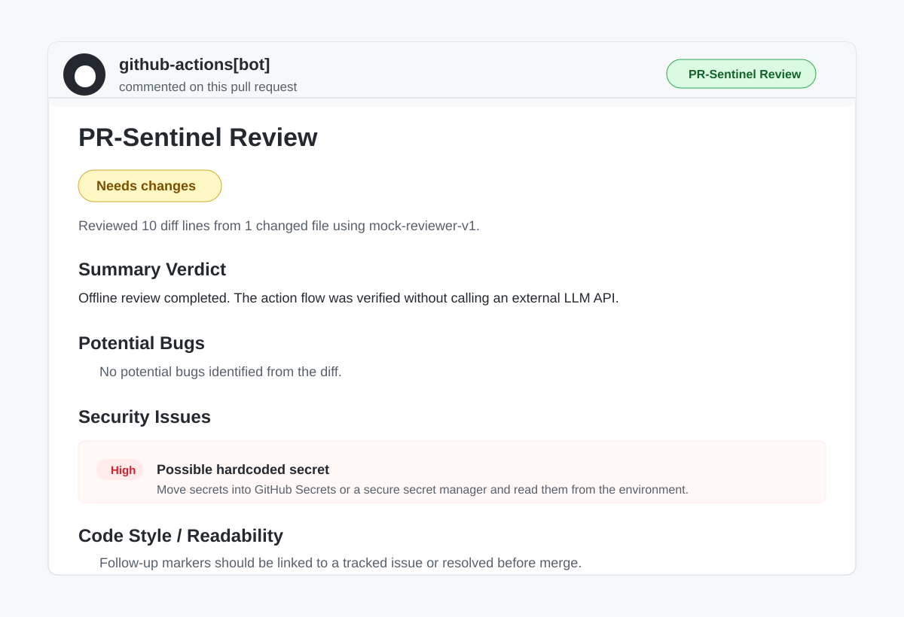

# PR-Sentinel

PR-Sentinel is a reusable GitHub Action that reviews pull requests and posts a first-pass review comment with possible bugs, security issues, readability feedback, and a short verdict.

I built this project to solve a common review problem: small but important issues often get noticed late because human reviewers have to spend time scanning the basic diff first. PR-Sentinel does that first pass automatically, so the reviewer can focus on design, logic, and final approval.

## What It Does

When a pull request is opened or updated, PR-Sentinel:

1. Reads the pull request details from GitHub.
2. Fetches the changed files and patch data using Octokit.
3. Builds a review prompt from the diff.
4. Sends the diff to a review provider.
5. Converts the response into a clean Markdown comment.
6. Posts or updates one PR comment instead of spamming the conversation.

The comment includes:

- Summary verdict: `Approve`, `Needs changes`, or `Comment`.
- Potential bugs.
- Security issues.
- Code style and readability issues.
- A clear fallback message if the review could not run.

## Why This Is Safe To Verify

The project has a `mock` provider that works without any external AI API, GitHub secret, or network call to an LLM. This is useful on restricted office laptops because the full action flow can be tested locally without touching any other person's repository.

For real GitHub verification, I only run it inside repos I own. I do not use random public repositories for testing because that can create unwanted notifications and comments for other maintainers.

## Local Verification

Run this from the project folder:

```bash
npm install
npm run verify
```

This checks three important paths:

- Normal review flow using the offline `mock` provider.
- Large diff skip flow when the PR is over `5000` diff lines.
- Gemini failure fallback flow, so API errors do not fail silently.

The command also writes sample output files into `verification-output/`:

- `success-review.md`
- `skip-large-diff.md`
- `gemini-failure-fallback.md`
- `summary.json`

These files show exactly what PR-Sentinel would post as a pull request comment.

## Real GitHub Verification

This repository includes a self-test workflow at `.github/workflows/pr-review.yml`. It runs PR-Sentinel on pull requests in this repo using the `mock` provider.

That means the real GitHub Action can be verified without a Gemini key. A successful run should:

- Trigger on a pull request.
- Fetch the PR diff.
- Run the local action from `./`.
- Post a PR comment from `github-actions[bot]`.

## Using It In Another Repo

Add this workflow to a repository you own:

```yaml
name: PR Review

on:
  pull_request:
    types: [opened, synchronize]

jobs:
  pr-sentinel:
    runs-on: ubuntu-latest
    permissions:
      contents: read
      pull-requests: write
      issues: write

    steps:
      - name: Run PR-Sentinel
        uses: sairishaliya/pr-sentinel@v1.0.1
        with:
          github_token: ${{ secrets.GITHUB_TOKEN }}
          llm_provider: mock
          model: mock-reviewer-v1
          max_diff_lines: "5000"
```

The `mock` provider is best for first testing because it does not need secrets.

## Live AI Review With Gemini

For live AI review, create a GitHub secret named `GEMINI_API_KEY`, then use:

```yaml
with:
  github_token: ${{ secrets.GITHUB_TOKEN }}
  llm_provider: gemini
  gemini_api_key: ${{ secrets.GEMINI_API_KEY }}
  model: gemini-2.5-flash
  max_diff_lines: "5000"
```

Gemini is used because it is easier to try with a free-tier developer API. The action is structured so another provider can be added later without changing the GitHub logic.

## Inputs

| Name | Required | Default | Description |
| --- | --- | --- | --- |
| `github_token` | Yes | None | Token used to read the PR and post comments. |
| `llm_provider` | No | `gemini` | Review provider. Supported values: `gemini`, `mock`. |
| `gemini_api_key` | For Gemini | None | Gemini API key. Not needed for `mock`. |
| `model` | No | `gemini-2.5-flash` | Model name for live Gemini review. |
| `max_diff_lines` | No | `5000` | Skips review when the diff is too large. |

## Architecture

```text
PR opened or updated
-> GitHub Action starts
-> Octokit fetches PR files
-> PR-Sentinel builds a diff prompt
-> mock or Gemini provider generates structured review data
-> PR-Sentinel formats Markdown
-> Octokit posts or updates the PR comment
```

The code is split by responsibility:

- `src/index.ts`: action entrypoint and workflow control.
- `src/github.ts`: GitHub API calls.
- `src/llm.ts`: provider selection, Gemini review, and mock review.
- `src/promptTemplate.ts`: review prompt template.
- `src/verify.ts`: local verification harness.

## Error Handling

PR-Sentinel is designed to fail clearly:

- If the diff is too large, it posts a skip comment.
- If Gemini fails because of rate limits or network issues, it posts a fallback comment.
- If GitHub permissions are missing, the workflow fails loudly so the permission issue is visible.

## Current Limitations

- The mock provider is deterministic and only catches simple patterns. It is for verification, not a replacement for a real LLM.
- The live provider currently supports Gemini only.
- The action posts a PR-level comment, not inline review comments.

## Screenshot

Example PR-Sentinel review comment:


